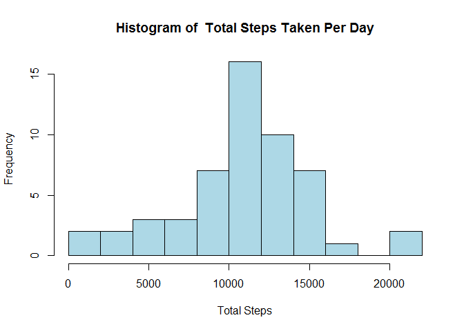
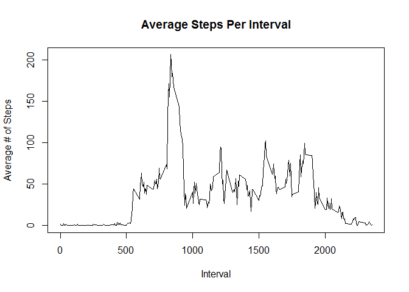
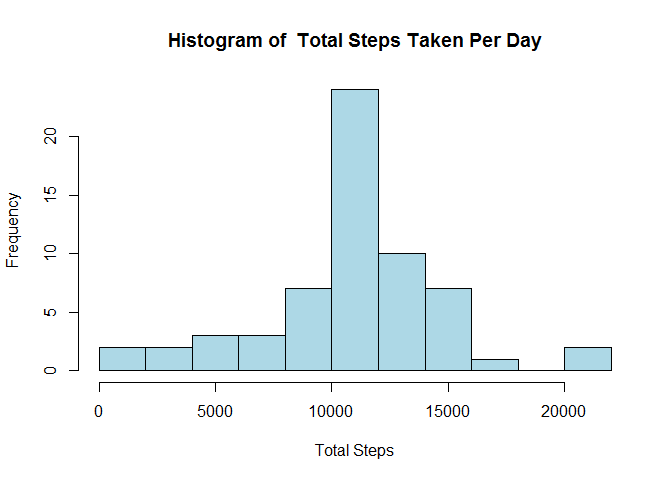
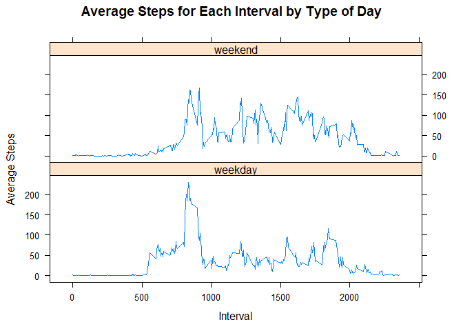

# Reproducible Research: Peer Assessment 1
Paul Ledin  
Saturday, March 25, 2017  

This is Course Project 1 for Coursera's Reproducible Research MOOC.

## Loading and preprocessing the data

```r
ActivityDS <- read.csv(unz("activity.zip", "activity.csv"), stringsAsFactors=FALSE)
ActivityDS$date <- as.Date(ActivityDS$date)

ActivityDSnoNAs <- ActivityDS[!is.na(ActivityDS$steps), ]
ActivityDSNAs <- ActivityDS[is.na(ActivityDS$steps), ]
```


## What is mean total number of steps taken per day?

```r
totalStepsPerDay1 <- aggregate(ActivityDSnoNAs$steps, by=list(ActivityDSnoNAs$date), FUN = sum)
names(totalStepsPerDay1) <- c("date", "total_steps")

hist(totalStepsPerDay1$total_steps, main="Histogram of  Total Steps Taken Per Day", breaks=10, col="lightblue", xlab="Total Steps")
```

<!-- -->

```r
mean(totalStepsPerDay1$total_steps)
```

```
## [1] 10766.19
```

```r
median(totalStepsPerDay1$total_steps)
```

```
## [1] 10765
```
The mean total number of step taken per day is 10,766 and median total number of steps is 10,765.


## What is the average daily activity pattern?

```r
avgStepsPerInterval <- aggregate(ActivityDSnoNAs$steps, by=list(ActivityDSnoNAs$interval), FUN = mean)
names(avgStepsPerInterval) <- c("interval","average_number_of_steps")

plot(avgStepsPerInterval, type="l", main="Average Steps Per Interval", xlab="Interval", ylab="Average # of Steps")
```

<!-- -->

```r
subset(avgStepsPerInterval, subset=avgStepsPerInterval$average_number_of_steps==max(avgStepsPerInterval$average_number_of_steps))
```

```
##     interval average_number_of_steps
## 104      835                206.1698
```
The 835 interval had the highest maximum number of steps averaged across all days in the data set with
a daily average of 206.2 steps.


## Imputing missing values

```r
nrow(ActivityDSNAs)
```

```
## [1] 2304
```

```r
NAsImputed <- merge(ActivityDSNAs, avgStepsPerInterval, by='interval')
NAsImputed <- NAsImputed[ ,c("interval", "date", "average_number_of_steps")]
names(NAsImputed) <- c("interval", "date", "steps")
ActivityDSBoth <- rbind(ActivityDSnoNAs, NAsImputed)

totalStepsPerDay2 <- aggregate(ActivityDSBoth$steps, by=list(ActivityDSBoth$date), FUN = sum)
names(totalStepsPerDay2) <- c("date","total_steps")

hist(totalStepsPerDay2$total_steps, main="Histogram of  Total Steps Taken Per Day", breaks=10, col="lightblue", xlab="Total Steps")
```

<!-- -->

```r
mean(totalStepsPerDay2$total_steps)
```

```
## [1] 10766.19
```

```r
median(totalStepsPerDay2$total_steps)
```

```
## [1] 10766.19
```
The data set had a total of 2,304 missing values.

I went with using the mean for the interval when imputing the the missing values.  The imputed values drove both the central tendancy measures toward the un-imputed average which is an interesting, although not all that surprising of a result.


## Are there differences in activity patterns between weekdays and weekends?

```r
ActivityDSBoth$day_of_week <- weekdays(strptime(ActivityDSBoth[,2], format="%Y-%m-%d"))
ActivityDSBoth$type_of_day[ActivityDSBoth$day_of_week=="Monday" | ActivityDSBoth$day_of_week=="Tuesday" 
                          | ActivityDSBoth$day_of_week=="Wednesday" | ActivityDSBoth$day_of_week=="Thursday" 
                          | ActivityDSBoth$day_of_week=="Friday"] <- "Weekday"

ActivityDSBoth$type_of_day[ActivityDSBoth$day_of_week=="Saturday" | ActivityDSBoth$day_of_week=="Sunday"] <- "Weekend"

avgByIntervalandTypeOfDay <- aggregate(ActivityDSBoth$steps, by=list(ActivityDSBoth$interval, ActivityDSBoth$type_of_day), FUN = mean, na.rm = TRUE)
names(avgByIntervalandTypeOfDay) <- c("interval", "type_of_day", "avg_steps")

library(lattice)
xyplot(avg_steps~interval | type_of_day, data=avgByIntervalandTypeOfDay, main="Average Steps for Each Interval by Type of Day", xlab="Interval", ylab="Average Steps", layout=c(1,2), type="l")
```

<!-- -->


Looks like Weekdays have a not terribly unexpected spike in the morning that is largely absent on the weekends as folks sleep in.


